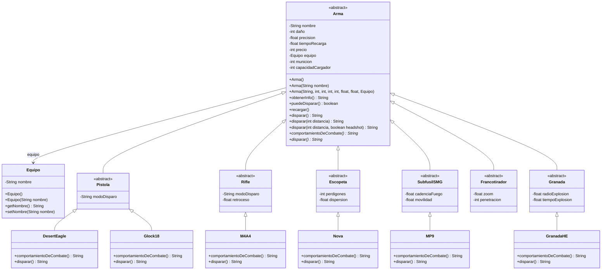

# Counter-Strike 2 - API REST (TP LP3)

[](LICENSE)

Trabajo practico de Lenguaje de Programación 3. Es un servicio web hecho con Spring Boot que modela las armas del juego Counter-Strike 2.

Para armar esto usé herencia, polimorfismo y encapsulamiento. Hay una clase abstracta Arma de la que heredan las demás (EJEMPLO Pistola, Rifle, Escopeta etc)

> **Commit de la entrega:** https://github.com/dianamariapaz2104/daquino-tp-lp3-2026/tree/main

## Como correrlo
Con Java 21, se puede levantar el proyecto desde la terminal así:
```bash
./mvnw spring-boot:run
```
Para ver si funciona se entra a `http://localhost:8080/`.

Para correr los tests del proyecto:
```bash
./mvnw test
```

## Qué cambió con la sobrecarga y sobreescritura?

**Sobrecarga:**
En la clase `Arma` y en las clases hijas armé varios constructores. Uno vacio, uno que recibe solo el equipo, y otro que recibe todos los datos (nombre, munición, etc).
También sobrecargué el metodo `disparar()`. Dependiendo de si le paso o no la distancia por parametro, hace distintas cosas. Lo que mas cambió es la comodidad para crear los objetos. En vez de tener un constructor gigante que me obligue a pasarle muchos datos, armé varias opciones. Asi el Controller instancia el arma justo con los datos que le llegan por la URL y listo. Ademas, al sobrecargar disparar(), evito inventar nombres como dispararBasico() o dispararConDistancia(): uso siempre el mismo metodo pero le paso distintos parámetros.

**Sobreescritura (Overriding):**
En mi clase abstracta `Arma` puse los metodos abstractos `comportamientoDeCombate()` y `disparar()`. Despues en cada clase concreta (como `M4A4`, `Glock18` o `Nova`) les puse el `@Override` y les di el comportamiento específico de ese arma. Así cuando llamo al metodo desde el controller, gracias al polimorfismo, me responde el arma que corresponde sin tener que usar comprobaciones como `instanceof`. 

## Endpoints

- **`GET /`** Devuelve mi nombre, el dominio y los endpoints que hay.
- **`GET /api/armas?nombre=M4A4&municion=20`** Crea el arma pasandole los parametros por URL usando el constructor sobrecargado y te devuelve el JSON. Si se le manda datos invalidos (ej.: municion negativa) marca error 400.
- **`GET /api/armas/polimorfismo`** Muestra una lista de todas las armas armadas usando la clase padre `Arma` y muestra como cada una responde distinto al método de combate.
- **`GET /api/armas/disparar?nombre=M4A4&distancia=10&headshot=true`** Muestra como funciona el método de disparo sobrecargado.

## Diagrama de Clases
Este es el diseño que armé para el paquete `domain`:


