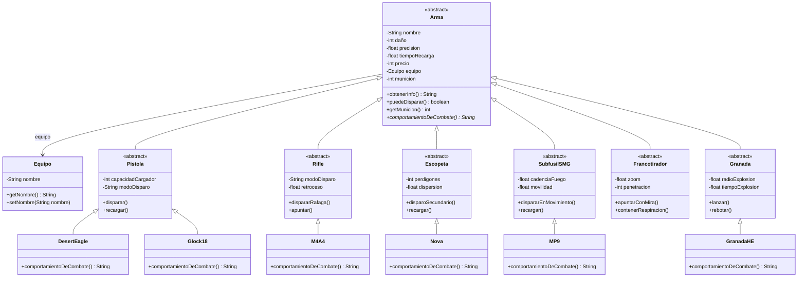

# Counter-Strike 2 - API REST

Servicio HTTP desarrollado con Spring Boot y Java 21 para modelar las armas de
Counter-Strike 2. El dominio aplica herencia, sobreescritura, encapsulamiento y
polimorfismo: todas las armas se tratan a través de la superclase `Arma`.

## Tecnologías

- Java 21
- Spring Boot
- Maven
- Spring Web

## Ejecución

```bash
./mvnw spring-boot:run
```

El servicio queda disponible en `http://localhost:8080`.

## Endpoints

### `GET /`

Confirma que el servicio está vivo y muestra la autora y el estado de la API:

```json
{
  "autora": "Diana",
  "dominio": "Counter",
  "estado": "API funcionando"
}
```

### `GET /api/armas?nombre=M4A4`

Construye un arma a partir del parámetro `nombre` y responde JSON con su estado
y comportamiento de combate. El nombre debe coincidir con una clase concreta del
dominio. Si el arma no existe, responde `404`.

Ejemplo:

```http
GET /api/armas?nombre=M4A4
```

```json
{
  "arma": "M4A4",
  "municion": 30,
  "comportamientoDeCombate": "Fusil de asalto automático, ráfagas precisas a media y larga distancia."
}
```

Otros ejemplos:

```json
{
  "arma": "Glock18",
  "municion": 20,
  "comportamientoDeCombate": "Pistola semiautomática de 9 mm con cargador amplio y fuego rápido controlable."
}
```

```json
{
  "arma": "Nova",
  "municion": 8,
  "comportamientoDeCombate": "Escopeta de perdigones dispersos, letal en combate cuerpo a cuerpo."
}
```

## Diseño de clases

Diagrama Mermaid de las clases reales del dominio y sus relaciones de herencia.



## Polimorfismo

El controller construye un arma a través de una fábrica y la guarda en una
referencia del tipo padre `Arma`. Luego pide el mensaje abstracto
`comportamientoDeCombate()` sobre esa referencia: cada arma concreta responde
con su propia implementación mediante sobreescritura (`@Override`), sin que el
controller conozca el tipo concreto ni use `instanceof`.