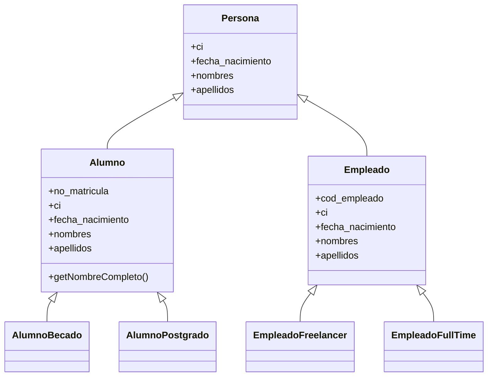

# Diagrama de Clases: Jerarquía de Persona, Alumno y Empleado

Este repositorio contiene la especificación y documentación del diagrama de clases UML representativo de la jerarquía de **Persona**, **Alumno**, **Empleado** y sus respectivas especializaciones.

---

## 📌 Descripción General

El modelo plantea una estructura orientada a objetos donde la clase base `Persona` abstrae los atributos personales fundamentales. De ella heredan las entidades `Alumno` y `Empleado`, las cuales extienden su comportamiento con atributos específicos de su rol y, a su vez, se especializan en subtipos según su condición académica o laboral.

---

## 🏛️ Estructura de Clases

### 1. `Persona` (Clase Base)
Representa la entidad general de la cual derivan las demás.
* **Atributos:**
  * `ci`: Documento de identidad o cédula.
  * `fecha_nacimiento`: Fecha de nacimiento de la persona.
  * `nombres`: Nombres de la persona.
  * `apellidos`: Apellidos de la persona.

---

### 2. Jerarquía de Alumno

#### `Alumno` (Hereda de `Persona`)
Modela a los estudiantes registrados en la institución.
* **Atributos:**
  * `no_matricula`: Número de matrícula único del estudiante.
  * `ci`, `fecha_nacimiento`, `nombres`, `apellidos`: Heredados/referenciados de `Persona`.
* **Métodos:**
  * `getNombreCompleto()`: Devuelve el nombre completo del alumno formateado.

#### Subclases de `Alumno`:
* **`AlumnoBecado`**: Representa a los estudiantes que cuentan con una beca académica o económica.
* **`AlumnoPostgrado`**: Representa a los estudiantes matriculados en programas de posgrado (maestrías, doctorados, especializaciones).

---

### 3. Jerarquía de Empleado

#### `Empleado` (Hereda de `Persona`)
Modela al personal laboral de la institución.
* **Atributos:**
  * `cod_empleado`: Código identificador del empleado.
  * `ci`, `fecha_nacimiento`, `nombres`, `apellidos`: Heredados/referenciados de `Persona`.

#### Subclases de `Empleado`:
* **`EmpleadoFreelancer`**: Empleados bajo modalidad de contratación independiente o por proyectos.
* **`EmpleadoFullTime`**: Empleados contratados a tiempo completo bajo relación de dependencia.

---

## 📊 Diagrama UML (Mermaid)

Puedes renderizar este diagrama directamente en GitHub, GitLab o en [mermaid.live](https://mermaid.live):

